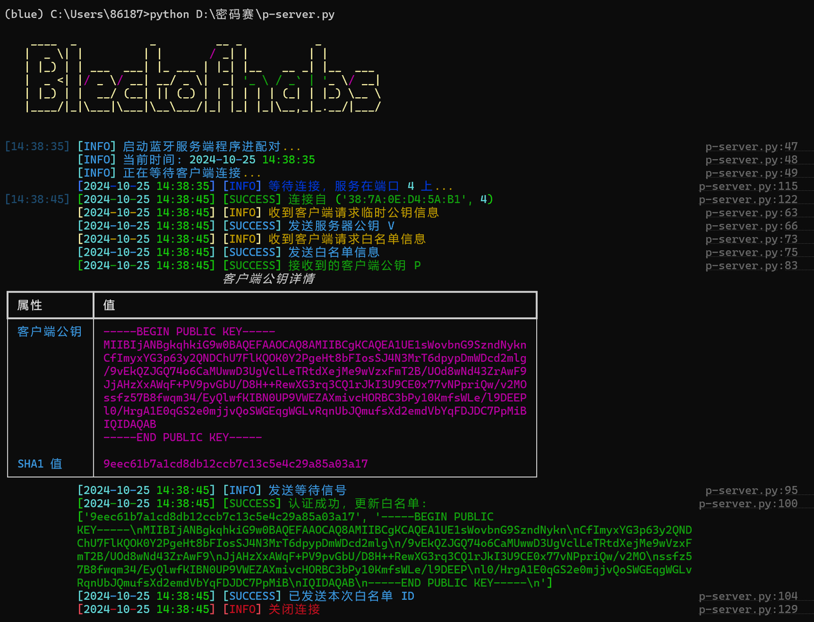
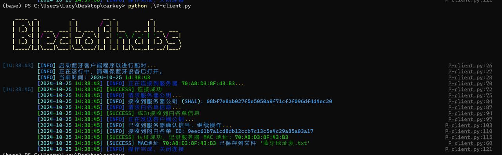
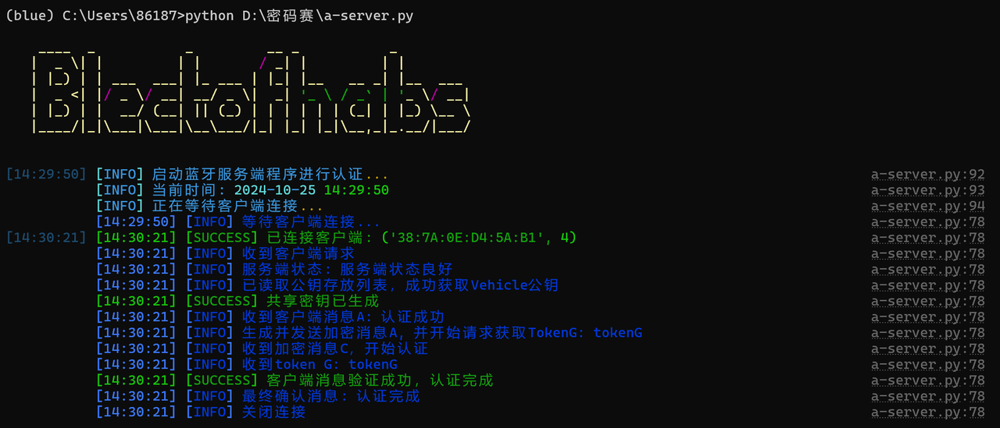
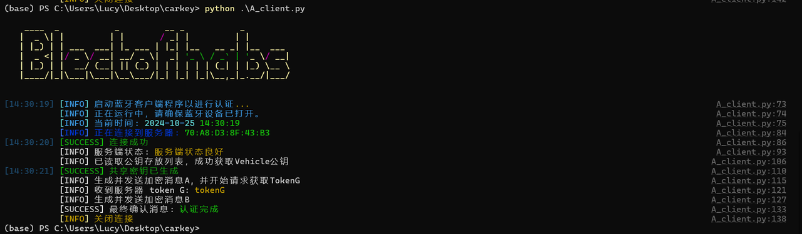
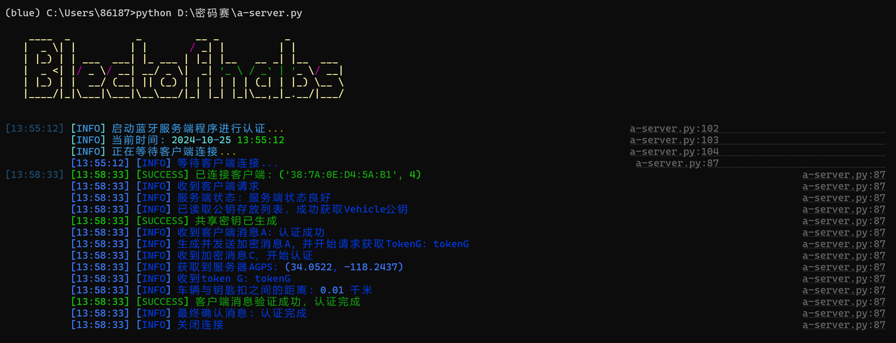
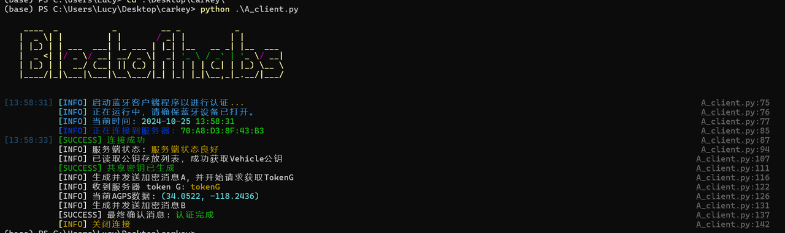
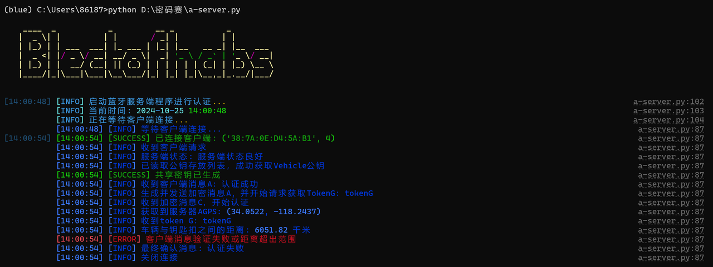
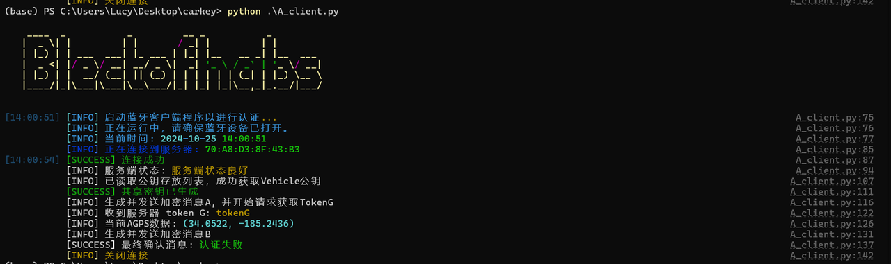

# 基于定位系统的无钥匙安全进入方案

## 目录
- [Quick Start](#quick-start)
- [Overview](#overview)
- [Contents](#contents)
  - [P-client.py](#p-clientpy)
  - [P-server.py](#p-serverpy)
  - [A-client-noGPS.py](#a-client-nogpspy)
  - [A-server-noGPS.py](#a-server-nogpspy)
  - [A-client.py](#a-clientpy)
  - [A-server.py](#a-serverpy)
- [如何使用](#如何使用)
- [测试结果示例](#测试结果示例)
  - [配对](#配对)
  - [认证：加密算法更改为AES-CBC](#认证加密算法更改为aes-cbc)
  - [加上AGPS](#加上agps)
- [依赖](#依赖)

## Quick Start
* 为成功模拟蓝牙通信的过程，实验开始前需要安装相应的库
 `pip install pybluez`
 若出现安装失败的现象，可以借用此链接：[下载pybluez](https://gitcode.com/gh_mirrors/py/pybluez/overview?utm_source=highlight_word_gitcode&word=pybluez&isLogin=1)

* 具体操作步骤如下：
 ```
 git clone https://github.com/pybluez/pybluez.git
 python setup.py install
 ```
 注意此脚本文件使用了c++编译环境，故系统中须提前安装visual studio编译工具。


## Overview
此项目包含以下python代码：
* P-client.py：用于配对阶段的客户端代码（含扫描过程）
* P-server.py ：用于配对阶段的服务端代码
* A-client.py ：用于认证阶段的客户端代码(添加AGPS)
* A-server.py ：用于认证阶段的服务端代码(添加AGPS)
* A-client-noGPS.py 用于认证阶段的客户端代码
* A-server-noGPS.py 用于认证阶段的服务端代码
* blue_scan.cpp 客户端扫描蓝牙设备代码

## Contents
P-client.py
此脚本处理**配对过程**任务：
* 与服务器端建立连接并交换公私钥。
* 将服务器端公钥存入自己公钥存放列表中。

P-client.py
此脚本处理**配对过程**任务：
* 与客户端建立连接并交换公私钥
* 将客户端公钥做SHA-1处理并存入自己的白名单WHITELIST_INFO中。

A-client-noGPS.py
此脚本处理**认证过程**任务：
* 与服务器端建立连接并读取公钥存放列表，生成共享密钥S
* 与服务器端互相加密传输认证过程消息
* 认证成功后，可以解锁服务端设备。

A-server-noGPS.py
此脚本处理**认证过程**任务：
* 与客户端建立连接并读取白名单，生成公钥密钥S。
* 与客户端互相加密传输认证过程消息。
* 认证成功后，被客户端解锁。

A-client.py
此脚本处理**添加AGPS后的认证过程**任务：
* 与服务端建立连接并读取公钥列表，生成共享密钥S。
* 与服务端互相加密传输认证过程消息。
* 新增AGPS坐标信息传递功能，用于后续认证操作。

A-server.py
此脚本处理**添加AGPS后的认证过程**任务：
* 与客户端建立连接并读取白名单中存放的客户端公钥，生成共享密钥S。
* 与客户端互相加密传输认证过程消息。
* 新增AGPS认证步骤，认证与客户端的距离，当连接超出可连接范围时，将认为存在中继攻击威胁并终止此次连接；连接在可接受范围内，则认证成功。

### 如何使用
* 配对阶段：

1.确保有两台拥有蓝牙的主机模拟通信，一台作为服务器端，一台作为客户端。

2.服务端运行：
`python P-server.py`

3.客户端运行：
`python P-client.py`

运行后可呈现出配对过程流程

* 认证阶段：

1.确保有两台拥有蓝牙的主机模拟通信，一台作为服务器端，一台作为客户端。

2.服务端运行：
```python A-server.py 或 python A-server-noGPS.py```

3.客户端运行：
```python A-client.py 或 python A-server-noGPS.py```

运行后可呈现出认证过程流程，涉及AGPS的流程还将拥有位置认证功能，有效抵御中继攻击。


## 测试结果示例

### 配对：
* 服务端：白名单存储成txt形式在本地

* 客户端：将认证成功的服务器mac地址存入txt中


### 一般认证（加密算法为AES-CBC）：
* 服务端：

* 客户端：


### 加上AGPS后的认证：
#### 车钥匙key与车距离在连接范围内，认证通过
* 服务端
  
* 客户端
  

#### 车钥匙key与车距离超出连接范围，认证失败
* 服务端：
  
* 客户端：
 

### 相关依赖
* pybluez
* crytography