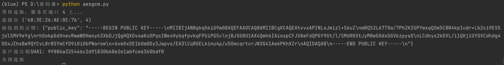
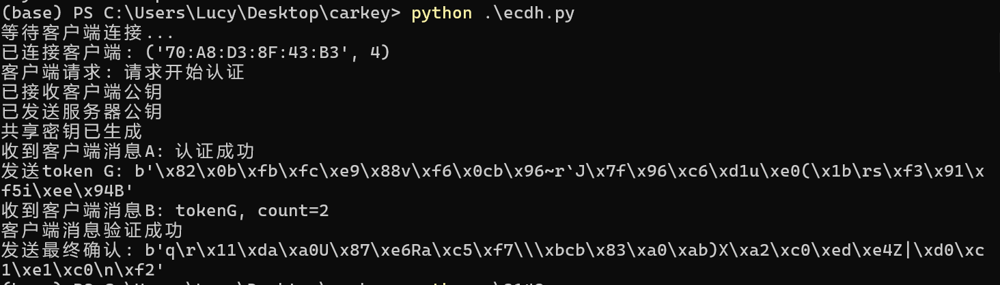
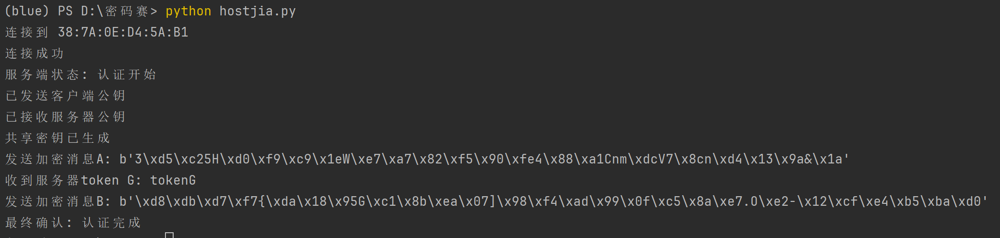

# 基于定位系统的无钥匙安全进入方案
## 目录
### `P-client.py` 配对客户端代码
### `P-sercer.py` 配对服务端代码
### `A-client.py` 认证客户端代码
### `A-sercer.py` 认证服务端代码

## 实现情况

### 配对：
* 服务端：白名单存储成txt形式在本地

* 客户端：将认证成功的服务器mac地址存入txt中

### 认证：加密算法改为AES-CBC
* 服务端：

* 客户端：

