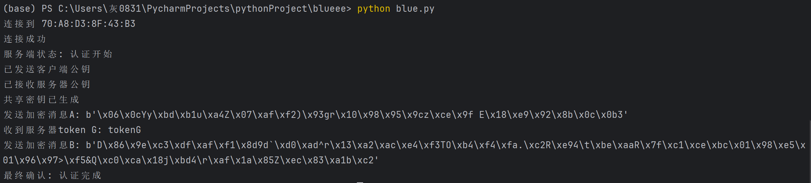
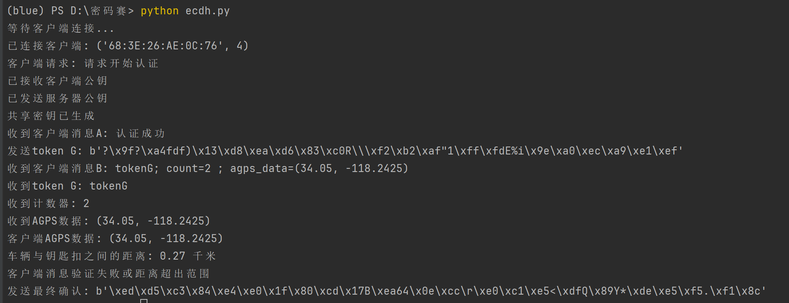
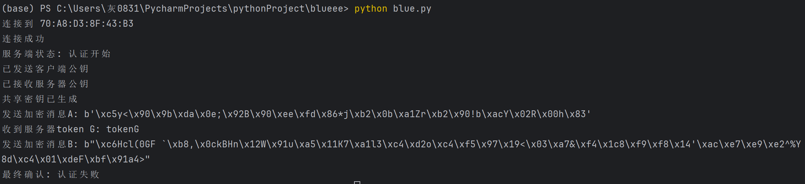

# 基于定位系统的无钥匙安全进入方案
## 目录
### `P-client.py` 配对客户端代码(y已更新扫描功能)
### `P-sercer.py` 配对服务端代码
### `A-client.py` 认证客户端代码(添加AGPS)
### `A-sercer.py` 认证服务端代码(添加AGPS)
### `A-client-noGPS.py` 认证客户端代码
### `A-sercer-noGPS.py` 认证服务端代码
### `blue_scan.cpp` 客户端扫描蓝牙设备

## 实现情况

### 配对：
* 服务端：白名单存储成txt形式在本地

* 客户端：将认证成功的服务器mac地址存入txt中

### 认证：加密算法更改为AES-CBC
* 服务端：

* 客户端：

### 加上AGPS：
#### 车钥匙key与车距离在连接范围内，认证通过
* 服务端
  
* 客户端
  

#### 车钥匙key与车距离超出连接范围，认证失败
* 服务端：
  
* 客户端：
